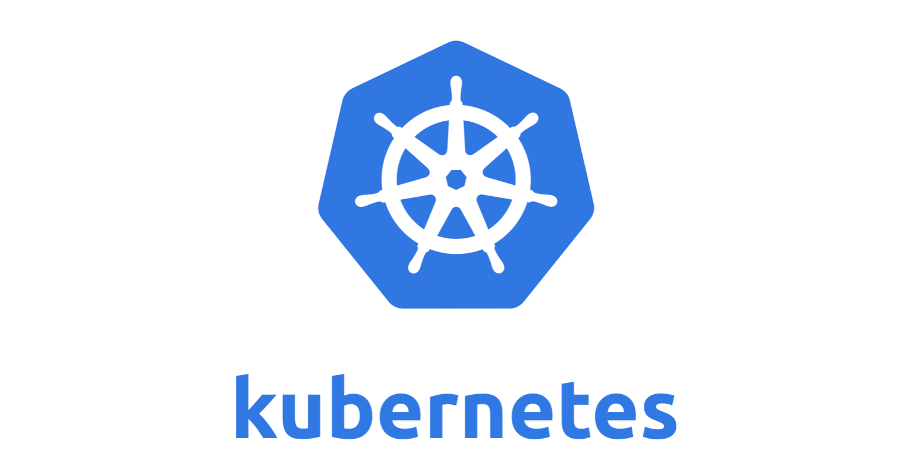
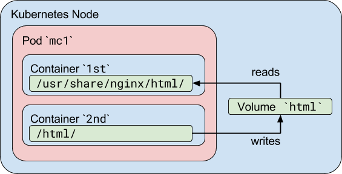

# C3i--HIGH-INTERACTION-HONEYPOT

# HONEYPOT

A honeypot is a computer security mechanism which is set to detect or deflect the unauthorised access of any information system. Generally honeypot consists of data, which seems to be legitimate part of the service, but is in isaloted enviroments and is frequently monitored.

**Honeypots are basically of 2 types:**

1. *Production Honeypots*: are easy to use, capture only limited information, and are used primarily by corporations. Production honeypots are placed inside the production network with other production servers by an organization to improve their overall state of security. Normally, production honeypots are low-interaction honeypots, which are easier to deploy. They give less information about the attacks or attackers than research honeypots.

2. *Research Honeypot*:  are run to gather information about the motives and tactics of attackers targeting different networks. These honeypots do not add direct value to a specific organization; instead, they are used to research the threats that organizations face and to learn how to better protect against those threats.Research honeypots are complex to deploy and maintain, capture extensive information, and are used primarily by research, military, or government organizations.

**Based on design Honeypot can be classified as:**

1. *Low Interaction Honeypot*: Low interaction honeypots basically do not provide much information about the attacker activites on some service. They can tell that who attacked the systems and when. They are not much complex to setup and are generally used to simulate the services most frequently used by the attackers.

2. *High Interaction Honeypot*: imitate the activities of the production systems that host a variety of services and, therefore, an attacker may be allowed a lot of services to waste their time. By employing virtual machines, multiple honeypots can be hosted on a single physical machine. Therefore, even if the honeypot is compromised, it can be restored more quickly. 

# ABOUT THE PROJECT

This  project involved bank of vulnerable services. Which included some of the most common services that can easily attract attackers to look on.
In this project we have used services :-

* HTTP SERVICE
* MYSQL SERVICE
* TELNET SERVICE
* SSH SERVICE
* SMTP SERVICE

### THE FIRST PHASE

The first phase was to create docker images for our vulnerable services. So we created dockerfile for each and installed the services from scratch using source code. To ensure that the services version are vulnerable we have installed the versions with CVE score greater than 7.5

### THE SECOND PHASE

The second phase was to basically create proxies for all the services mentioned above in order to log down each activity performed by user on the service. Proxies have been written in python using libraries like paramiko (For SSH), twisted (for TELNET), smtplib (for SMTP) while the core of each proxy lied in the implementation of python sockets.

### THE THIRD PHASE

The third phase involved setting up the kubernetes cluster. We have used a 3 noded kubernetes cluster (1 master and 2 slaves nodes)

Steps used for setting cluster (these steps are for setting 2 noded cluster)

One VM for master node and aother VM for slave node
1st adapter : NAT
2nd adapter:  BRIDGED ADAPTER

* $ swapoff -a
* vi /etc/fstab comment out the swap entry

* vi /etc/network/interfaces # edit this to make the bridge interface ip alloted to you, to make it static.  
The loopback network interface  
auto lo  
iface lo inet loopback  
auto eth1  
iface eth1 inet static  
address 192.168.1.4  

* vi /etc/hosts  (setup the hostname and ip configuration)  
*192.168.1.4  masternode  
*192.168.1.7  kubeworker1  

* cat > /etc/sysctl.d/20-bridge-nf.conf <<EOF  
  net.bridge.bridge-nf-call-iptables = 1  
  EOF
 
* sysctl --system

* cat > /etc/docker/daemon.json <<EOF  
  {  
  "exec-opts": ["native.cgroupdriver=systemd"],  
  "log-driver": "json-file",  
  "log-opts": {  
    "max-size": "100m"  
  },  
  "storage-driver": "overlay2"  
  }  
   EOF  
   
* sudo apt-get install -y kubelet kubeadm kubectl
  
* kubeadm init --pod-network-cidr=10.244.0.0/16 --apiserver-advertise-address=192.168.1.4 (Initialize the pod network)

* kubectl apply -f https://raw.githubusercontent.com/coreos/flannel/master/Documentation/kube-flannel.yml  
kubectl apply -f https://raw.githubusercontent.com/coreos/flannel/master/Documentation/k8s-manifests/kube-flannel-rbac.yml

* edit the flannel for --iface to be used and then  kubectl apply -f flannel.yaml (If required)

* systemctl restart docker.service
  systemctl restart kubelet.service

* Join the nodes using kubeadm join command, this command would appear on your command line once you set the flannel network. Copy it and save it for using at end and when joining nodes.

### THE FOURTH PHASE
The fourth phase after setting up kubernetes cluster was to explore the idea of using honeypot with kubernetes cluster.

**MultiContainer Pod**

Multicontainer pod basically involves running more than one docker containers inside a same pod. This will help us to make a communication channel between our proxy services and vulnerable services. There are many ways in which two containers can communicate if they are in same pod.  One way is by using **shared volume**, in this a common host storage is selected which is then being shared between all the containers.  And second way is by using **IPC**, containers in the same pod share common network space, that means they can communicate with each other using local host. 

### THE FIFTH PHASE

The Fifth phase Taking the whole setup offline. This phase basically involved having all images locally present. We dont want our honeypot to depend on dockerhub to download images. So here we created a private local registry server which can be used by the all the nodes to download images when required.

This is a private registry set up for saving images after building from dockerfiles.

It has been setup using docker-compose along with the concept of persistent volume to save the images permanently in a volume store.
STEPS TO CONFIGURE AND SETUP PRIVATE REGISTRY SERVER

* got to /etc/docker/daemon.json if not already there create it.  
And edit it as follows:  
{  
"insecure-registries": ["kubemaster:5000"]  
}  
* Once the daemon.json is set,restart the docker service (systemctl restart docker)  
* docker-compose up  
* docker tag <image_name>:<tag> kubemaster:5000/<image_name:tag>  
* docker push kubemaster:5000/<image_name:tag>  
* docker pull kubemaster:5000/<image_name:tag>  
* perform step 1 on all the nodes

### THE SIXTH PHASE

The sixth phase was to set up a logging architecture. As we are having around  more than five services to be deployed on kubernetes cluster, each service would be generating it's own set of logs. So it becomes necessary to have a centralized logging mechanism. For this we have used **fluentd**. It is a third party tool which has got a great support for kubernetes. It is basically a logging agent that is setup on each proxy service to direct the logs collected from each vulnerable service to a common interface or command line. Fluentd can be used along with kibana and elastic search to have a proper visualization of all the logs on the basis of tagging done(to identify logs separtely). We haven't used elastic search or kibana, we have directed all the logs to separate machine stdout.

### THE SEVENTH PHASE

This phase involved deciding the logging strategy. Till now we have developed all the setup that is required to be deployed on the cluster. 
So we are going to use **sidecar methodolgy** to perform logging in our honeypot architecture. Side car methodology basically involves running a side car container that would 
basically  fetch the log from the other container in the same pod and will direct the logs towards it's stdout.
The logging can be performed basically in two ways:

* Forwarding the logs from proxy server to a fluentd aggregator:   
In this strategy the sidecar container that would be deployed in the pod will redirect all the logs collected from the vulnerable machine via proxy container and will redirect it to a fluentd aggregator container that would also be deployed on the cluster.
This way all the sidecar container running in their specific pods will direct their logs to common machine.

* Deploying Fluentd Daemonset:  
In this strategy, the sidecar containers rather than directing logs to a fluentd aggregator will direct the logs to their own STDOUT. Which are by default logged on the local machine by docker at /var/lib/docker and /var/log.
These logs would be fetched up by the fluentd daemonset which will be deployed on each node and then these logs would be forwarded to a fluentd aggregator at last.

**ARCHITECTURE FOLLOWED IN PROJECT**

       
  
**Run The Project**
* Develop all the docker images using docker files on the master node. (In /HONEYPOT)
* Set up local registry following steps given in DOCKER_SERVICES/MYIMAGES/LOCAL_REGISTRY/rules.txt
* Set up the kubernetes cluster using YAML STEPS. (You can also use your own way of setting up cluster)
* First deploy the services.yaml file using command $ kubectl apply -f services.yaml
* Then deploy the proxies.yaml file using command $ kubectl apply -f proxies.yaml 

 ## FUTURE ENHANCEMENTS
 * Including more vulnerable services in the bank. (Done)
 * Dividing services into subsets. (Done)
 * Integrating services within the subsets. The integration can be performed in following ways:-
   * Integrating using ***default interface*** as provided by the application. The services can communicate in single pod using the local host.
   * Integrating through shared volume in Kubernetes.
   * Integrating by running services in a single pod. As a standalone server.
   
 * Thus a subset created would be completely act as deception environment with many services running in a single pod.. (Done)
 * Setting up a logging method for subsets. (In progress)
 

